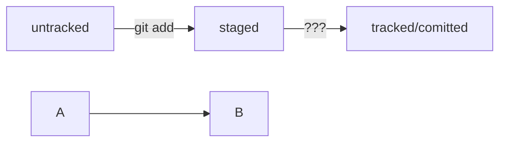

# Регистрация на GitHub: инструкция.
1. В правом верхнем углу главной страницы GitHub нажмите на Sign up.
2. Введите адрес электронной почты, пароль, имя пользователя.
3. Выберите рассылку обновлений и новостей на почту.
4. Пройдите капчу.
5. Нажмите Create account.
6. Введите короткий код для подтверждения регистрации.
7. Поздравляем: вы успешно зарегистрировались на GitHub.

# основные команды Git
_**git init**_ - Сделать папку репозиторием

_**rm -rf .git**_ - «Разгитить» папку с репозиторием

_**git status**_ - Проверить состояние репозитория

_**git add**_ - Подготовить файл к сохранению

_**git add --all**_ - Подготовить к сохранению сразу все файлы

_**git add .**_ - Добавить в репозиторий текущую папку со всеми файлами

_**git commit**_ - Выполнить коммит

_**git log**_ - Просмотреть историю коммитов

_**git log --oneline**_ - Получчить сокращенный лог
_**git push origin main**_  - Отправьте коммит в удаленный репозиторий

_**HEAD**_ - Это файл в папке .git, в котором записана ссылка (или ссылка на ссылку) на последний коммит.Eсли нужно передать последний коммит, то вместо его хеша можно просто написать слово HEAD — Git поймёт, что вы имели в виду последний коммит.

**статусы**_ 
*untracked* - новые файлы в Git-репозитории помечаются как untracked, то есть неотслеживаемые. Git «видит», что такой файл существует, но не следит за изменениями в нём. У untracked-файла нет предыдущих версий, зафиксированных в коммитах или через команду git add.
*staged* - После выполнения команды git add файл попадает в staging area, то есть в список файлов, которые войдут в коммит. В этот момент файл находится в состоянии staged.
*tracked* - Состояние tracked — это противоположность untracked. Оно довольно широкое по смыслу: в него попадают файлы, которые уже были зафиксированы с помощью git commit, а также файлы, которые были добавлены в staging area командой git add. То есть все файлы, в которых Git так или иначе отслеживает изменения.
*modified* - Состояние modified означает, что Git сравнил содержимое файла с последней сохранённой версией и нашёл отличия. Например, файл был закоммичен и после этого изменён.

_**Оформление сообщений к коммитам**_
Оформление сообщений к коммитам в Git может подчиняться определённым правилам, которые могут быть продиктованы культурой команды или техническими ограничениями.
В выводе команды git log --oneline умещается максимум 72 первых символа сообщения, поэтому многие правила включают пункт: «Сообщение не должно быть длиннее 72 символов».
В этом уроке рассмотрим несколько популярных подходов к оформлению сообщений коммитов.
Все люди разные и у всех есть предпочтения - в том числе, как формулировать сообщения коммитов.
Без единообразия коммитов нет и эффективной работы в Git.
В корпоративном стиле в начале сообщения обычно указывают Jira-ID, а после - текст сообщения.
Conventional Commits предлагает такой формат коммита: <type>: <сообщение>.
Для сообщений на русском языке часто рекомендуют использовать инфинитивы, а для сообщений на английском рекомендуется использовать повелительное наклонение.

_**Подсказка: как сделать mermaid-схему**_

Чтобы получить mermaid-схему в README.md, нужно добавить блок кода типа mermaid.

HEAD -- это голова.
Коммит -- это всему голова.
Статусы файлов:
<тут пустая строка!>

```mermaid
%% описание схемы
```
<и тут пустая строка!> 
Блоки кода в маркдауне начинаются и заканчиваются тремя символами ```. После первых трёх ``` можно указать, какой именно код будет внутри блока. Например: ```mermaid , ```bash, ```python, ```javascript и так далее. Если ничего не указать, GitHub будет считать весь код простым текстом.
💡 Перед блоком и после него нужны пустые строки, иначе GitHub может не понять, что это блок кода.
Два символа %% обозначают в mermaid строку-комментарий.
Чтобы сделать схему, нужно указать формат: graph LR. Graph — это простейший тип схем; для шпаргалки его будет достаточно.
Чтобы добавить элементы и связи (стрелки), используют строки вида A --> B. Такая строка создаст квадратные блоки А и B и соединит их стрелкой.

Дополнительно можно указывать текст на стрелке. Например, так: A -- "text" --> B.
Ниже вы найдёте заготовку для схемы статусов файлов.

Попробуйте описать схему самостоятельно и посмотреть, что получится!